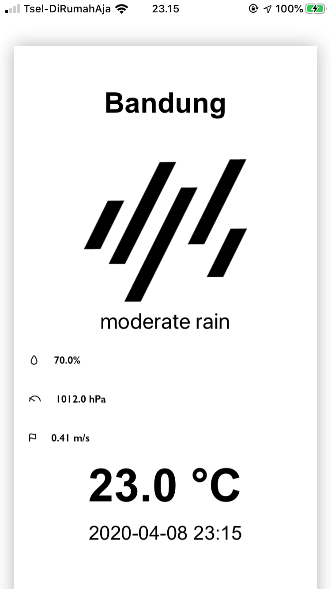

# SimpleWeather
This repo is the answer of Jojonomic take home test.

### Special Notes:
- Please run `$ pod install` after cloning this repo from GitHub or downloading it from email. It should ensure the podfiles are installed correctly for the project.
- Please use `master` branch to review my answer and run the projects in Simulator/Real Device.
- The UI design is based on [Tatsuya Sawanobori's work](https://projects.invisionapp.com/prototype/weather-cjg0l9l5z000ju601bjam93ol/play/08954382).

### Check List:
#### Fungsi Utama:
- [x] Mendapatkan user current location.
- [x] Mendapatkan cuaca berdasarkan user location.
- [x] Dapat memperbaharui data cuaca / refresh.
#### Fungsi Optional:
- [x] Dapat menampilkan data offline.
- [ ] Dapat search berdasarkan kota dan menampilkan cuaca kota tsb.
- [x] Menggunakan MVP/MVVM/MVI/VIPER atau sejenisnya -> MVVM.
- [x] Unit test.

### Screenshots:
- Home screen:

- Pull to refresh:

